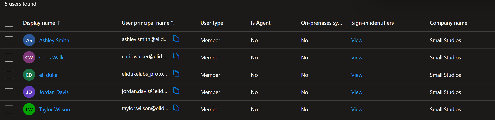
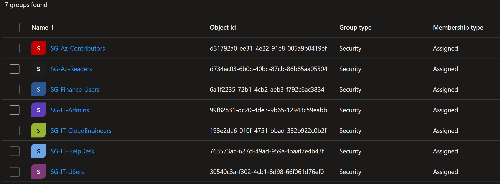
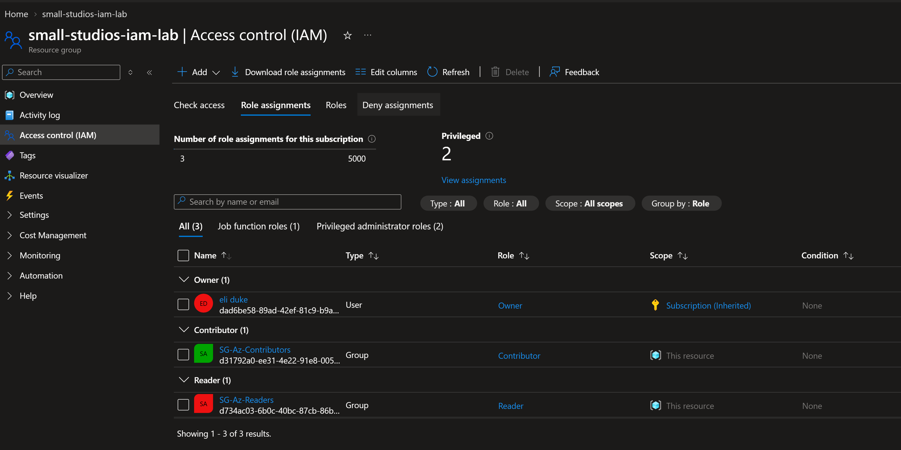
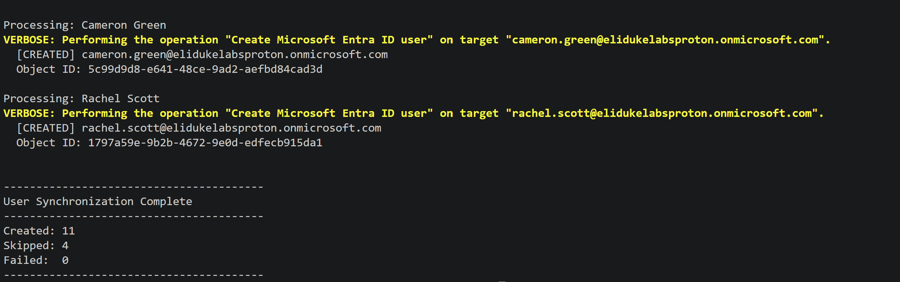
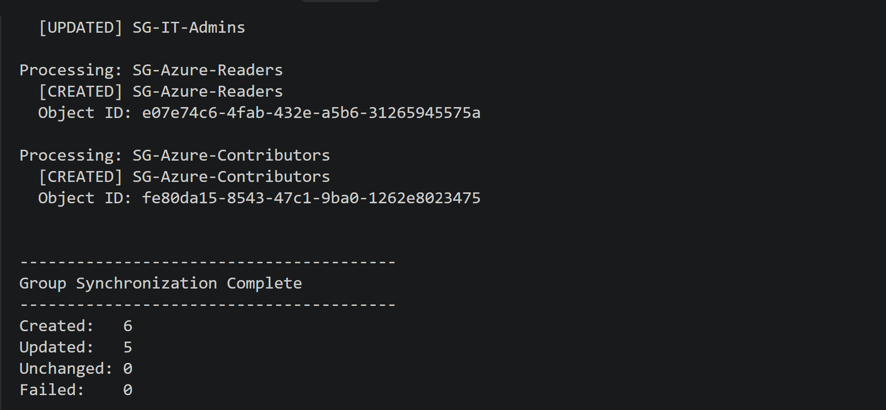
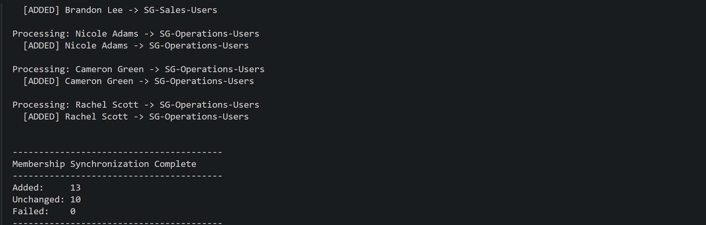
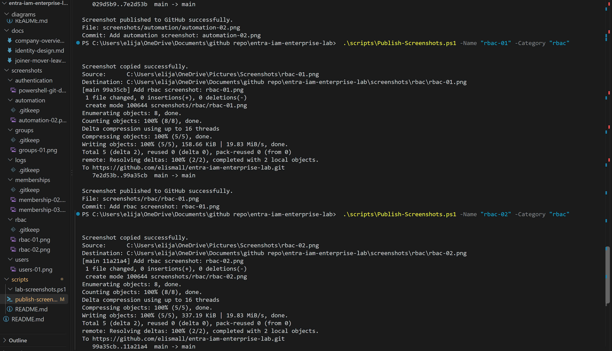
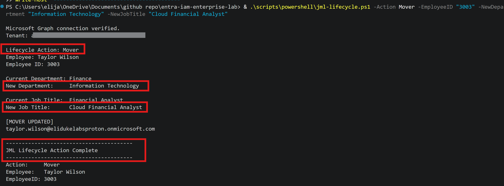
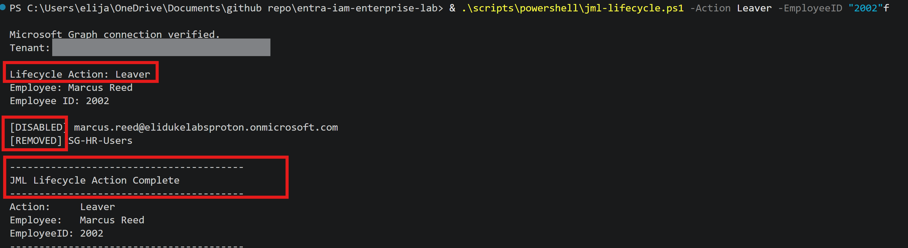

# Implementation Evidence

This directory contains screenshots captured during the implementation and testing of the Microsoft Entra ID IAM lab.

The screenshots provide evidence of user provisioning, security group management, Microsoft Graph automation, Azure RBAC configuration, and identity lifecycle workflows.

## Users

### User Provisioning

Shows fictional employee identities successfully provisioned in Microsoft Entra ID with attributes including department, job title, and company information.

---

## Groups

### Security Groups

Shows department, job-role, privileged, and Azure RBAC security groups used to implement group-based access control.

---

## Memberships

### Group Membership Assignments

Demonstrates users receiving access through Microsoft Entra security group memberships rather than direct permission assignments.

---

## RBAC

### Azure Role Assignments

Shows Microsoft Entra security groups assigned Azure RBAC roles such as Reader and Contributor at the lab resource scope.

---

## Automation

### Microsoft Graph User Synchronization

Shows the PowerShell user synchronization workflow successfully comparing CSV identity data with Microsoft Entra ID.

The script creates missing users, updates managed attributes, and avoids duplicate accounts.

### Group Synchronization

Demonstrates PowerShell and Microsoft Graph synchronizing security group definitions from `groups.csv`.

### Membership Synchronization

Shows group membership reconciliation successfully completing with existing memberships detected and missing assignments added.

---

## Authentication

### Microsoft Graph Authentication

Shows PowerShell successfully authenticating to Microsoft Graph through the registered Entra application.

---

## Identity Lifecycle

### Mover Workflow

Demonstrates a Mover lifecycle event where an employee's department and job title are changed as responsibilities change.

### Leaver Workflow

Demonstrates the planned Leaver workflow for disabling an identity and removing access during employee offboarding.